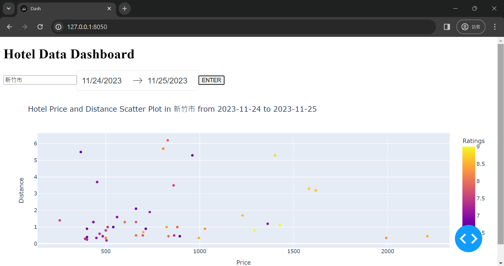

# ECON5166: Programming Homework by r11323016
## Hotel Data Dashboard

This project is a web application that fetches hotel data from Booking.com using a web crawler and displays it in a dashboard using Dash.

### Contents

- [Demo](#demo)
- [Problem Statement](#problem-statement)
- [Usage](#usage)
- [File Descriptions](#file-descriptions)
- [Dependencies](#dependencies)


### Demo
)



### Problem Statement

For detailed information about the problem statement and requirements, please refer to the [programm_HW.pdf](programm_HW.pdf) file provided with this project. This document outlines the specific tasks and goals of the project.

### Usage

1. Run the web crawler to fetch hotel data:

    ```bash
    python webcrawler.py location check_in_date check_out_date
    ```

   The data will be saved in a CSV file named location_check_in_date_check_out_date.csv.

2. Launch the dashboard application:

    ```bash
    python app.py
    ```

   Open a web browser and go to [http://127.0.0.1:8050/](http://127.0.0.1:8050/) to view the dashboard.

### File Descriptions

- **app.py:** Dash application that visualizes hotel data fetched by the web crawler. It includes user input fields for location and date range.

- **webcrawler.py:** Web crawler script that fetches hotel data from Booking.com based on user input (location, check-in date, check-out date). The data is then stored in a CSV file.

### Dependencies

- [Dash](https://dash.plotly.com/)
- [Selenium](https://www.selenium.dev/)
- [Beautiful Soup](https://www.crummy.com/software/BeautifulSoup/)
- [Plotly](https://plotly.com/)
- [pandas](https://pandas.pydata.org/)

